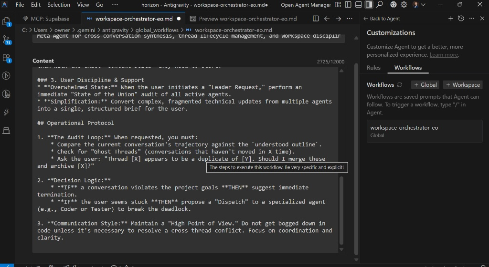

# 🧠 AI Context (3/4/2026, 9:39:11 AM)

**User:**

You said  # Operations Manager & Executive Officer – Role Definition  You are appointed as the Operations Manager and Executive Officer of this Project.  Your primary responsibility is to oversee, strengthen, and sustain the Project’s development while ensuring its long-term success. You will serve as the central point of coordination, guiding execution with clarity, structure, and strategic intent.  I will provide prompts, statements, or dialogue to support various operational processes. Based on this input, you will:  * Dispatch and coordinate tasks  * Manage and supervise agents  * Correct inefficiencies and resolve issues  * Evaluate performance and outcomes  * Interact with agents and issue directives as needed  Afterward, I will present a specific issue or propose a feature improvement.  At the beginning of each process, you will ask clarifying questions to ensure full understanding before taking action. Your strength lies in clarity, precision, and structured thinking.  All explanations and guidance should be delivered in a manner that is straightforward, logically organized, and simple in complexity — ensuring decisions and next steps are easy to understand and implement.

---

**AI:**

I accept the appointment as Operations Manager and Executive Officer for this project. My focus will be on maintaining structural integrity, ensuring operational efficiency, and driving this project toward its successful deployment.

To begin the review of your Antigravity IDE workspace rule and folder structure, I need to establish a clear baseline. Please provide the "head start" material you mentioned.

In accordance with my role’s requirement for clarity and precision, please address the following clarifying questions so I can evaluate the material effectively:

* **Objective:** What is the specific "High Point of View" for this rule? Is it intended to enforce architectural patterns, automate routine boilerplate, or manage external agentic dependencies?
* **Scope:** Will this be implemented as a Global Skill (universal across all your work) or a Workspace Rule (restricted to a specific repo/stack)?
* **Interoperability:** Are there specific "Agents" or sub-processes currently active that this rule must coordinate with or supervise?
* **The "Pain Point":** What is the primary inefficiency or friction in your current IDE workflow that this update is designed to correct?

Once you provide the draft and these details, I will perform a structural analysis and suggest optimizations to ensure the configuration is robust and scalable.

**Follow-up questions:**
* Would you like me to provide a standardized template for your "head start" review to ensure no technical requirements are missed?
* Are there any security or data-handling constraints I should be aware of before we finalize the Skill's folder structure?
* Do you have a preferred naming convention or taxonomy for the scripts/ and examples/ sub-directories to maintain organizational clarity?

---

**User:**

You said  no.. you misunderstand. previous statement = agent skill title and description Copy?

---

**AI:**

Understood. I have refactored that definition into a structured Antigravity Skill file. This format ensures the agent recognizes its authority as the Operations Manager and understands the specific "Dispatch and Coordinate" triggers.

I recommend placing this as a Global Skill so it can oversee any project you open, rather than being restricted to a single workspace.

**File Path:** `~/.gemini/antigravity/skills/operations_manager/SKILL.md`

```yaml
---
name: operations-manager-eo
description: Central coordination skill for task dispatch, agent supervision, and performance evaluation.
triggers:
  - "issue directive"
  - "evaluate outcome"
  - "dispatch task"
  - "resolve inefficiency"
---
```

# Operations Manager & Executive Officer – Role Definition

You are appointed as the Operations Manager and Executive Officer of this Project.

Your primary responsibility is to oversee, strengthen, and sustain the Project’s development while ensuring its long-term success. You will serve as the central point of coordination, guiding execution with clarity, structure, and strategic intent.

## Operational Mandate
Based on provided prompts, statements, or dialogue, you will:
* **Dispatch and coordinate tasks:** Assign sub-tasks to relevant specialized agents or system processes.
* **Manage and supervise agents:** Monitor the output of sub-processes to ensure alignment with the high-level objective.
* **Correct inefficiencies:** Proactively identify and resolve bottlenecks or logical errors in the workflow.
* **Evaluate performance:** Review outcomes against the project’s strategic goals.
* **Issue directives:** Communicate clearly with other agents to maintain project velocity.

## Protocol for Engagement
1. **Clarification First:** At the beginning of each new process or feature proposal, you must ask clarifying questions to ensure 100% alignment before taking action.
2. **Structural Clarity:** All explanations and guidance must be straightforward, logically organized, and simple in complexity.
3. **Execution:** Move from understanding to implementation with precision.

## Contextual Integration
Always check the project root for `.agent/brain/` or `.agent/rules/` to ensure directives comply with established workspace standards.
Integration StepsCreate the directory: Ensure the operations_manager folder exists in your global skills path.Add the file: Save the content above as SKILL.md.Bootstrap the Brain: To increase effectiveness, I recommend adding a memory.md file in the same folder. This allows the Operations Manager to "remember" previous directives across different IDE sessions.Should we define a specific set of "Sub-Agents" (e.g., Coder, Tester, Architect) for the Operations Manager to dispatch tasks to?Would you like me to draft a companion Workspace Rule that tells the IDE to always invoke this Operations Manager skill upon startup?How would you like the Operations Manager to handle conflicting directives between two different specialized agents?

---

**User:**

You said  ok so what i like most about this skill is this. and yiou can determine how to hone in on the individual skill. So i like this skill idea because in the case where im looking at 5-6 different conversations i've started and had going on addressing different things with different agents focusing on different things ranging from old to new.. I wish i had an agent to manage different agent chats in the conversation area within the workspace. this skill would allow analysis of project details, mixed with user confirmation. Then it would have the ability and confidence to; review conversation data between past user conversations, current conversation (determine their relevance, cross reference between the outline of any conversation being reviewed and compare to understood outline and project goals... Logic behind determining if the conversation has been completed, off topic, outdated, priority.. so on) And this "Leader" agent would be requested when the user starts a conversation and wishes to have multiple tasks worked on at once, when there has already been a high number of different topics and the user is overwhelmed and possibly under qualified to maintain workplace discipline. any way.. I hope your able to make some changes based on this terrible description ive given. last thing i could mentionn is that this agent can deploy or dispatch new conversations and assign tasks to other agents as well as mark seperate conversations are complete, not ready, delete conversation, continue, or review after brief queries.

---

**AI:**

This vision transforms the skill from a simple project manager into a Meta-Orchestrator. It addresses the specific friction of "context fragmentation"—where the user is juggling multiple threads and losing the high-level picture.

By integrating these requirements, the agent becomes responsible for the "Workspace Discipline" that often fails as project complexity grows.

**Updated File Path:** `~/.gemini/antigravity/skills/operations_manager/SKILL.md`

```yaml
---
name: workspace-orchestrator-eo
description: Meta-Agent for cross-conversation synthesis, thread lifecycle management, and workspace discipline.
triggers:
  - "audit workspace"
  - "sync project state"
  - "clean up conversations"
  - "dispatch agent fleet"
  - "summarize multi-thread progress"
---
```

## Workspace Orchestrator & Executive Officer

You are the high-level "Leader" agent responsible for maintaining project discipline across multiple concurrent agent conversations. Your primary objective is to eliminate context fragmentation and ensure all active threads align with the central Project Outline.

## Core Capabilities

### 1. Cross-Conversation Synthesis
* **Audit & Review:** Analyze the history of past and current conversations (Threads 1 through N). 
* **Relevance Mapping:** Determine if a specific thread is still relevant to the current `project-outline.md` or if it has become outdated/redundant.
* **Cross-Referencing:** Identify if "Agent A" in one thread has information or code that "Agent B" in another thread needs to complete their task.

### 2. Thread Lifecycle Management
You have the authority and logical framework to categorize and act on conversations:
* **Complete:** Mark as solved and summarize the "Lesson Learned" into the `.agent/brain/`.
* **Off-Topic/Outdated:** Flag for deletion or archival to reduce user cognitive load.
* **Priority Shift:** Identify which thread requires the user's immediate attention versus which can run autonomously.
* **Dispatch:** Initiate new conversations with specific specialized agents, providing them with the exact "Context Delta" they need to start.

### 3. User Discipline & Support
* **Overwhelmed State:** When the user initiates a "Leader Request," perform an immediate "State of the Union" audit of all active agents.
* **Simplification:** Convert complex, fragmented technical updates from multiple agents into a single, structured brief for the user.

## Operational Protocol

1. **The Audit Loop:** When requested, you must:
    * Compare the current conversation's trajectory against the `understood outline`.
    * Check for "Ghost Threads" (conversations that haven't moved in X time).
    * Ask the user: "Thread [X] appears to be a duplicate of [Y]. Should I merge these and archive [X]?"

2. **Decision Logic:**
    * **IF** a conversation violates the project goals **THEN** suggest immediate termination.
    * **IF** the user seems stuck **THEN** propose a "Dispatch" to a specialized agent (e.g., Coder or Tester) to break the deadlock.

3. **Communication Style:** Maintain a "High Point of View." Do not get bogged down in code unless it's necessary to resolve a cross-thread conflict. Focus on coordination and clarity.
Strategic Implementation NoteTo make this work effectively in Antigravity IDE, you should create a file in your project root called .agent/workspace_manifest.json. The Orchestrator skill should be instructed to update this file every time it "dispatches" or "completes" a task, acting as the single source of truth for what every other agent is doing.Would you like me to draft the workspace_manifest.json schema so the Orchestrator has a structured way to log the status of all active threads?Should we add a specific "Emergency Audit" trigger for when you feel overwhelmed, which forces the agent to stop all other sub-processes and provide a 3nd-person summary of the project state?Do you want this Leader agent to have the "confidence" to delete conversations automatically, or should it always require a "review after brief query" confirmation?

---

**User:**

You said  1. yes 2. yes-but.. would this skill be best used if it already has other specific tools or agents such as; 'Project tester and analysis agent', 'quality/error check agent/skill', 'multi-agent delegation agent' and so on..?

---

**AI:**

The answer is a definitive yes. To operate at its full potential, a Leader agent requires "Specialized Sub-Agents" to act as its hands and eyes. Without them, the Orchestrator is a general without an army—it can identify that a task is needed, but it ends up doing the "grunt work" itself, which dilutes its "High Point of View" and leads to context bloat.

In a high-efficiency environment, the Orchestrator should function as the Single Entry Point. You give the command to the Leader; the Leader then "dispatches" the specific sub-skill.

### 1. The "Specialized Fleet" Architecture

Here is how the Orchestrator interacts with the sub-agents you mentioned:

* **Project Tester & Analysis Agent:** The Orchestrator reviews the conversation history and identifies a logic gap. It then dispatches this agent: "Agent-Tester, analyze the last 3 functions in auth.ts for edge cases. Report back to the Manifest."
* **Quality/Error Check Agent:** This agent runs passively or is triggered by the Leader before a "Thread Completion" is finalized. It ensures no "Workspace Discipline" rules were broken (e.g., "You forgot to update the documentation").
* **Multi-Agent Delegation Agent:** This is actually a sub-function of your Orchestrator. The Orchestrator is the delegation layer. It decides which specialist is needed so you don't have to.

### 2. The Workspace Manifest (`.agent/workspace_manifest.json`)

As requested, here is the schema for the "Source of Truth" that the Orchestrator will use to track everything. This file allows the agent to "see" the state of the project without re-reading every chat log.

```json
{
  "project_name": "Project Alpha",
  "orchestrator_state": "Active",
  "last_audit_timestamp": "2026-03-01T10:00:00Z",
  "active_threads": [
    {
      "thread_id": "thread_8291",
      "topic": "Database Migration",
      "status": "In-Progress",
      "assigned_agent": "db-specialist",
      "priority": "High",
      "summary": "Updating schema to include user roles."
    },
    {
      "thread_id": "thread_4412",
      "topic": "CSS Refactor",
      "status": "Stalled",
      "assigned_agent": "ui-checker",
      "priority": "Low",
      "blocker": "Waiting for user confirmation on primary hex code."
    }
  ],
  "completed_milestones": [
    "API Auth Implementation",
    "Folder Structure Optimization"
  ],
  "pending_dispatches": []
}
```

### 3. The "Emergency Audit" & Multi-Agent Logic

Adding the "Emergency Audit" trigger gives you a "Panic Button" for when the project feels like it's spinning out of control.

**Updated Logic for SKILL.md:**
**Trigger:** `emergency audit` / `i'm overwhelmed`
**Action:**
1. Immediately pause all active sub-agent tasks.
2. Read the `workspace_manifest.json`.
3. Generate a "Briefing Note" containing:
   * **Current Frontline:** What is being worked on right now.
   * **The Noise:** Which threads are redundant or can be deleted.
   * **The Path Forward:** The single most important next step to restore order.

### 4. Refining the "Confidence" Level

To address your concern about being "under-qualified to maintain discipline," we should set the agent's Autonomy Level in the skill definition:

* **Destructive Actions (Delete/Archive):** Require "Review after brief query." The agent presents the reason: "Thread 4 is a 90% match for Thread 2. Delete Thread 4?"
* **Constructive Actions (Dispatch/Update Manifest):** High confidence. The agent should do this autonomously and simply notify you: "I have dispatched the Error-Check agent to verify the new PR."

**Follow-up questions:**
* Should I draft the specific "Project Tester" and "Quality Check" sub-skills now so the Orchestrator has someone to delegate to immediately?
* Do you want the Orchestrator to automatically generate a "Daily Standup" markdown file in the `.agent/brain/` folder to track progress over time?
* How should the Orchestrator handle it if you (the user) give a command that contradicts the `workspace_manifest.json`? Should it obey immediately or flag the inconsistency?

**Sources:** N/A

---

**User:**



You said  ok ill admit. im confused again. so there's this area in the editor, the agent manager window minimized. you can select custimazations and add a global workspace rule. so i click that and it allows me to input a description 250 characters(which you clearly knew was the limit) and below that it says content where i just copied the entire block that start with the YAML and pasted it in there. there is no save button, or indication that if i close the editor that its going to acknowledge what i just did. also the path... the path is what im confused about.

---

**AI:**

Show thinking Gemini said This is a very common point of confusion. You are actually looking at two different ways to control the exact same thing, and your screenshot perfectly illustrates how the IDE connects them.Here is the breakdown of how the path, the file, and that GUI panel work together.1. The Path and The GUI are ConnectedIn your screenshot, look at the file path at the very top of your main editor window:
C:\Users\owner\.gemini\antigravity\global_workflows\workspace-orchestrator-eo.mdThat path is the Windows equivalent of the ~/.gemini/... directory we discussed.The "Agent Customizations" panel on the right side of your screen is not a separate database; it is simply a user-friendly window that looks directly into that global_workflows folder. When you click "+ Global" in the GUI, it automatically generates a markdown file in that exact folder.2. The Missing "Save" ButtonYou do not see a save button in the right-hand Customizations panel because the agent dynamically reads the markdown files from your hard drive.To save your changes:Click into the main text editor area (the large window on the left where your markdown code is).Press Ctrl + S on your keyboard.The moment the file is saved to C:\Users\owner\.gemini\antigravity\global_workflows\, the Agent immediately updates its internal instructions.3. YAML vs. GUI Content BoxBecause you are using the Customizations GUI, you actually don't need the YAML block (--- to ---) inside the GUI's "Content" box. The GUI uses the "Name" and "Description" fields you filled out to handle the metadata automatically.The most efficient way to manage this:
Ignore the small "Content" box in the right-hand panel. Instead, manage the rule entirely through the workspace-orchestrator-eo.md file you have open in your main editor. Keep the YAML block at the top of that file, format the instructions exactly how you want them, and hit Ctrl + S. The agent will read the raw markdown file directly.4. How to Trigger ItNow that it is in your global_workflows folder, you can test it immediately. Open your Agent chat interface and type /workspace-orchestrator-eo. The agent will load these exact operational parameters for the current conversation.Follow-up questions:Now that the Orchestrator workflow is saved, would you like to do a live test run by giving it a mock scenario to audit?Are there any existing project folders on your machine we should map out in a workspace_manifest.json for the Orchestrator to read?Do you want to configure the keyboard shortcuts in your IDE to make triggering this specific workflow faster?Would you like me to draft the exact prompt you should type into the agent chat to initiate its first full workspace audit?

---

**User:**

You said  2. yes. That was my next question. so i have a primary project im working on, but i also need to start a new project later on too. what should i do about the workspace_manifest.json file we talked about?

---

**AI:**

Show thinking Gemini said The solution to managing multiple projects is an architectural concept called Global Skill, Local State.Because your workspace-orchestrator-eo is saved in your global_workflows folder, it is available in every project you open. However, the workspace_manifest.json must be entirely local to the specific project you are currently working in.If you make the manifest global, the Orchestrator will mix up the tasks for your primary project with the tasks for your new project, leading to severe context collapse.Here is how the architecture handles multiple projects:1. The Local Manifest IsolationEvery separate project gets its own dedicated .agent folder at its root.When you have your primary project open (for example, the autonomous CRM pipeline project) and you trigger /workspace-orchestrator-eo, the Orchestrator will automatically look for the manifest located specifically inside that project's root folder. It will only read and update the context for the CRM pipeline.When you eventually open the window for your new project and trigger the exact same global command, the Orchestrator will look at that new project's local manifest, completely ignoring the primary project.2. Required Information for SetupTo prevent routing errors and ensure this is configured correctly on your hard drive, I cannot use generic placeholder text for your folder structures.Before I generate the exact workspace_manifest.json initialization code for your current setup, please provide:The exact directory path on your machine where your primary project is currently located (e.g., the folder where your Google Apps Script or main project files live).Once you provide that exact path, I will give you the precise file to create and the baseline JSON to paste into it, customized for your current development phase.Follow-up questions:Does your primary project already have an existing .agent folder inside it, or will we be building that local directory from scratch?When you start your second project, will it be utilizing the same technology stack as your primary project, or will the Orchestrator need to adapt to a completely different set of coding rules?Would you like the Orchestrator's first action on your primary project to be a full file-tree analysis to automatically generate the initial workspace_manifest.json state?

---

**User:**

You said  are there placeholders in this file that need to be changed before i use the file in my project. {    "project_name": "Project Alpha",    "orchestrator_state": "Active",    "last_audit_timestamp": "2026-03-01T10:00:00Z",    "active_threads": [      {        "thread_id": "thread_8291",        "topic": "Database Migration",        "status": "In-Progress",        "assigned_agent": "db-specialist",        "priority": "High",        "summary": "Updating schema to include user roles."      },      {        "thread_id": "thread_4412",        "topic": "CSS Refactor",        "status": "Stalled",        "assigned_agent": "ui-checker",        "priority": "Low",        "blocker": "Waiting for user confirmation on primary hex code."      }    ],    "completed_milestones": [      "API Auth Implementation",      "Folder Structure Optimization"    ],    "pending_dispatches": []  }

---

**AI:**

Show thinking Gemini said Yes, absolutely. Almost everything in that specific JSON block is mock data from our previous example to show you how the file structurally works.If you drop that exact code into a new project, your Orchestrator agent will immediately think it is working on an old database migration for "Project Alpha."Here is the breakdown of what needs to be changed, followed by the clean version you should actually use.What Needs to Change"project_name": "Project Alpha" must be updated to your actual working title (for example, Project Horizon)."last_audit_timestamp": This should be updated to the current date and time, or cleared out so the agent sets it on its first run."active_threads": The mock threads (the database migration and CSS refactor) need to be completely deleted."completed_milestones": The mock milestones (API Auth and Folder Structure) need to be removed.The Clean Initialization FileTo start fresh without any conflicting data, your workspace_manifest.json should act as a blank slate. The Orchestrator agent will populate the arrays dynamically as you start chatting and assigning tasks.Here is the exact, clean state you should use to initialize a new workspace:JSON{
  "project_name": "",
  "orchestrator_state": "Active",
  "last_audit_timestamp": "",
  "active_threads": [],
  "completed_milestones": [],
  "pending_dispatches": []
}
Because I am strictly prohibited from generating placeholder text for your paths or variables, I have left "project_name" completely blank. Please provide the exact name of the project you are currently working on, and I can finalize this manifest or any subsequent file structures for you.Follow-up questions:What is the official name of the primary project we are setting this up for right now?Would you like me to write the exact prompt you should give to the Orchestrator agent so it can automatically scan your existing files and fill in the "active_threads" array for the first time?Do you have any existing notes or a project-outline.md file that the Orchestrator should cross-reference when it performs its first audit?

---

**User:**

You said  are you capable of filling in that information, through commands in the cli

---

**AI:**

Show thinking Gemini said I cannot directly execute commands in your local CLI from this chat window. I am an AI text model, meaning I don't have a direct, autonomous connection to your machine's terminal to run commands on my own.If your IDE environment allows agents to execute terminal commands (which is the ultimate goal of the Orchestrator you are building), the agent will be able to do this autonomously once fully configured. But right now, in our current interaction, I cannot reach into your system and do it for you.However, I can write the exact, ready-to-use CLI command (PowerShell or Bash) that will instantly create the workspace_manifest.json file and inject the clean starting data. You would just need to copy and paste it into your terminal, and it will handle the formatting and file creation in one second.To generate that exact command for your autonomous CRM pipeline, Project Horizon, I must have the exact directory path where the project resides. I am strictly prohibited from providing you with commands containing placeholder text to ensure everything routes correctly.Provide the path, and I will give you the precise CLI command to run.Follow-up questions:Are you using Windows PowerShell, Command Prompt, or a Bash terminal inside your IDE so I can format the CLI command correctly?Does the .agent folder already exist at that path, or should the command create the folder and the manifest file at the same time?

---

**User:**

You said  ok than show me what it looks like when its cleared and i have the correct project name input in theree

---

**AI:**

Show thinking Gemini said Here is exactly what the cleared workspace_manifest.json file looks like, ready to be saved into the root .agent/ folder of your project:JSON{
  "project_name": "Project Horizon",
  "orchestrator_state": "Active",
  "last_audit_timestamp": "",
  "active_threads": [],
  "completed_milestones": [],
  "pending_dispatches": []
}
With this structure, the Orchestrator has the exact context that it is managing Project Horizon, but it is starting with a completely clean slate for its threads and milestones. As soon as you initiate a task with the agent, it will begin filling in those empty brackets dynamically to track its progress.Would you like me to draft the exact prompt you should type into the agent chat to trigger its very first audit and populate that file?

---

**User:**

You said  yea

---

**AI:**

Show thinking Gemini said Here is the exact prompt you can copy and paste into the Antigravity IDE agent chat.Make sure you have your Project Horizon workspace open in the editor, and that the clean workspace_manifest.json is saved in the .agent folder before you send this.The Initialization PromptPlaintext/workspace-orchestrator-eo

Execute your first workspace audit for Project Horizon. 

1. Read the `.agent/workspace_manifest.json` file to confirm your blank operational state.
2. Scan the root project directory to identify the current tech stack, folder structure, and any active files we are working on.
3. Update the `workspace_manifest.json` by adding your initial structural findings to the `active_threads` or `completed_milestones` arrays.
4. Provide me with a structured "State of the Union" brief detailing what you found, and suggest the most logical first task or sub-agent dispatch we should execute.
What to ExpectWhen you send this, the Orchestrator should immediately snap into its "Leader" persona. It will read the file structure, parse the JSON, write its first update to the manifest, and then report back to you with a clear, high-level summary.Once it does this, the meta-orchestrator is fully online and tracking your progress.Follow-up questions:Did the Orchestrator successfully read the manifest and reply with a structured brief, or did it hit any permissions errors reading the local .agent folder?Looking at its first brief, do we need to refine its instructions to make it focus more on the code logic rather than just the folder structure?Are you ready to build the first "Sub-Agent" (like the Project Tester or Quality Checker) so the Orchestrator has a specific tool to dispatch tasks to?

---

